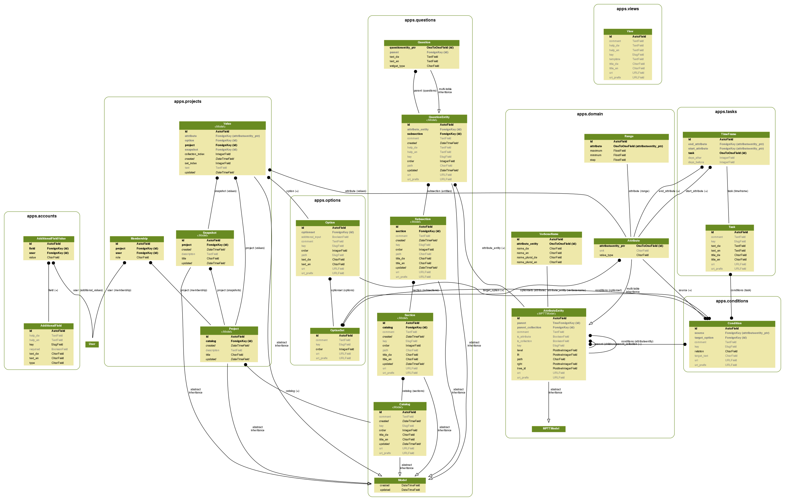

Figures
=======

Below is a graphical representation of the different models in rdmo, created with ``graphviz``:

To create/update the figure, install `graphviz`:

.. code:: bash

    sudo apt install graphviz-dev    # Debian/Ubuntu
    sudo yum install graphviz-devel  # RHEL/CentOS

Then, in your virtual environment install ``pygraphviz``:

.. code:: bash

    pip install pygraphviz

Then create the image using:

.. code:: bash

    ./manage.py graph_models \
        accounts conditions domain options questions projects tasks views \
        -g > docs/_static/img/models.dot

    dot -Tsvg -o docs/_static/img/models.svg docs/_static/img/models.dot
    dot -Tpdf -o docs/_static/img/models.pdf docs/_static/img/models.dot
    dot -Tpng -o docs/_static/img/models.png docs/_static/img/models.dot
