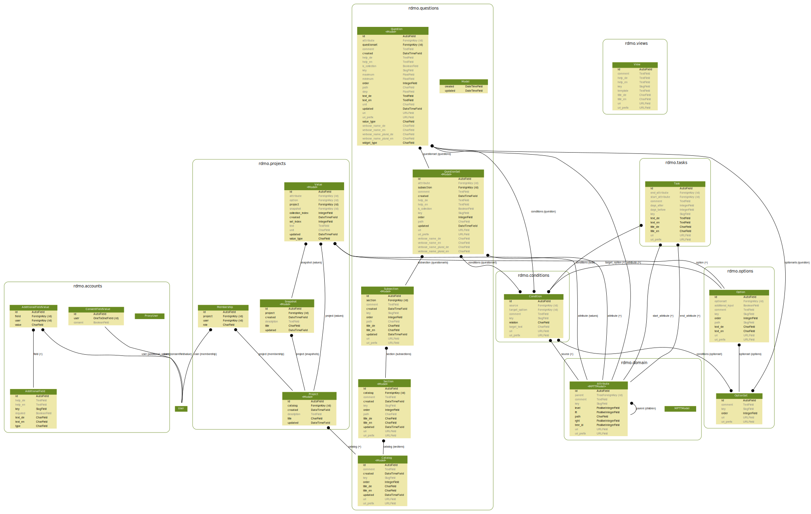

Figures
=======

Below is a graphical representation of the different models in rdmo, created with `graphviz`:

[](img/models.svg)

To create/update the figure, install `graphviz`:

```bash
sudo apt install graphviz-dev    # Debian/Ubuntu
sudo yum install graphviz-devel  # RHEL/CentOS
```

Then, in your virtual environment of your `rdmo-app`, install `pygraphviz`:

```bash
pip install pygraphviz
```

Then create the image using:

```bash
./manage.py graph_models \
    accounts conditions domain options \
    questions projects tasks views -g > models.dot

dot -Tsvg -o models.svg models.dot
dot -Tpdf -o models.pdf models.dot
dot -Tpng -o models.png models.dot
```
