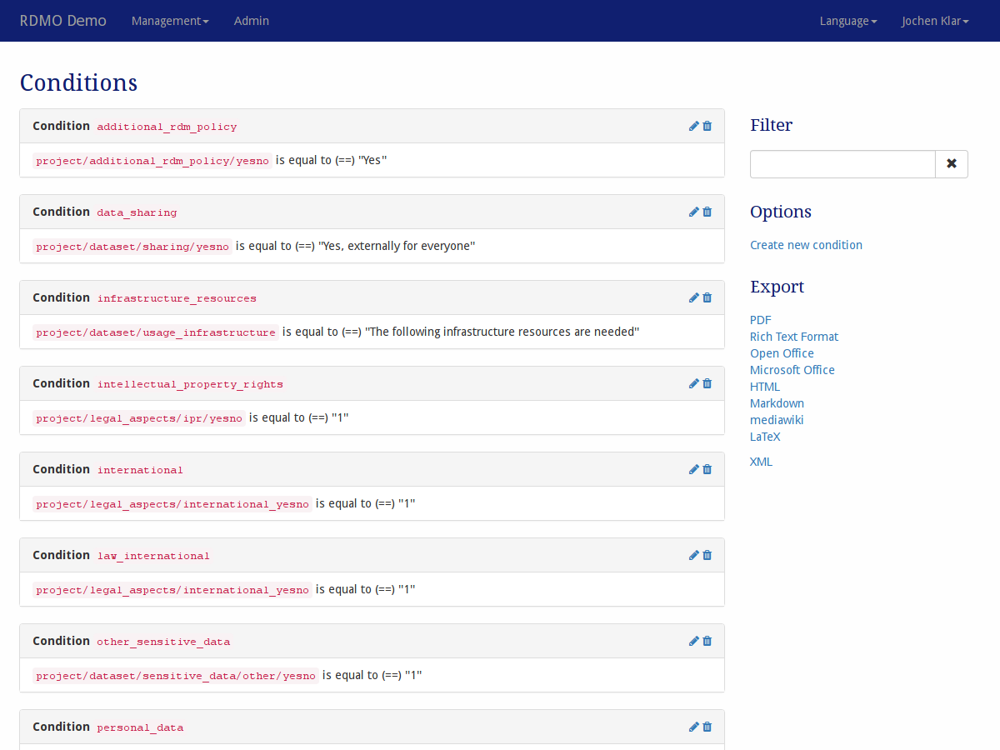

Conditions
----------

Conditions can be created and managed under *Conditions* in the management menu in the navigation bar. They are later connected to Entities, Attributes, Option sets, or Tasks.

   Screenshot of the conditions management interface.

On the left-hand side is the main display of all the conditions available in this installation of RDMO. Conditions show their key and a textual representation of what they evaluate. On the left side of each conditions panel, icons indicate ways to interact the element. The following options are available:

* **Update** (|update|) a condition to change its properties.
* **Delete** (|delete|) a condition. **This action cannot be undone!**

The sidebar on the left shows additional interface items:

* **Filter** filters the view according to a user given string. Only conditions containing this string in their path will be shown.
* **Options** offers additional operations:

  * Create a new condition

* **Export** exports the conditions to one of the displayed formats. While the textual formats are mainly for presentation purposes, the XML export can be used to transfer the conditions to a different installation of RDMO.

Conditions have different properties to control their behavior. As descibed in :doc:`the introduction <index>`, all elements have an URI Prefix, a key, and an internal comment only to be seen by other managers of the RDMO installation. In addition, you can edit the parameters below:

Condition
"""""""""

Conditions are configured with a source attribute, which will be evaluated, a relation like "equal" or "greater than" and a target. The target is a text string or an option. As an example, if the source is the attribute ``project/legal_aspects/ipr/yesno``, the relation is "equal to", and the target text is "1", the condition will be true for a project where the answer to the question connected to the attribute ``project/legal_aspects/ipr/yesno`` is "1" (or "yes" for a yesno widget).

Source
  The Attribute this condition is evaluating.

Relation
  The Relation this condition is using.

Target (Text)
  If using a regular attribute, the text value this condition is checking against.

Target (Option)
  If using an options attribute, the option this condition is checking against.
