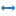
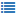

Domain
------

The domain model can be managed under *Domain* in the management menu in the navigation bar.

.. figure:: ../_static/img/screens/domain.png
   :target: ../_static/img/screens/domain.png

   Screenshot of the domain management interface.

On the left-hand side is the main display of all the entities and attributes available in this installation of RDMO. The attributes and entities show their path and if they are configured to be a collection. On the left side of each elements panel, icons indicate ways to interact the element. The following options are available:

* **Add** (|add|) a new attribute or entity to an entity.
* **Update** (|update|) an entity or attribute to change its properties.
* **Update range** (|range|) of an attribute. The range is only needed if the attribute is connected to a question using the slider widget.
* **Update option sets** (|optionsets|) of an attribute. Option sets determine the choices when the attribute is connected to a question using a select, radio button oder check boxes widget. The option sets themselves are configured in the :doc:`the options management <options>`.
* **Update verbose name** (|verbosename|) of an entity or attribute. For an entity, the verbose name is displayed to the user when adding sets to a question (instead of "Add set", e.g. "Add dataset"), while for an attribute the verbose name is displayed when adding items to a question with multiple answers instead (instead of "Add item", e.g. "Add keyword").
* **Update conditions** (|conditions|) of an entity or attribute. A question connected to an attribute with one or more conditions will be skipped automatically in the questionaire, when the condition is evaluated to be false. The same holds for question sets connected to an entity with a condition. The conditions themselves are configured in :doc:`the conditions management <conditions>`.
* **Delete** (|delete|) an entity or attribute and all of it's decendents (e.g. an entity and all the entities and attibutes below in the domain model tree). **This action cannot be undone!**

.. |add| image:: ../_static/img/icons/add.png
.. |update| image:: ../_static/img/icons/update.png

.. |conditions| image:: ../_static/img/icons/conditions.png

.. |delete| image:: ../_static/img/icons/delete.png

The sidebar on the left-hand side shows additional interface items:

* **Filter** filters the view according to a user given string. Only elements containing this string in their path will be shown.
* **Options** offers additional operations:

  * Create a new (empty) entity
  * Create a new (empty) attribute

* **Export** exports the current catalog to one of the displayed formats. While the textual formats are mainly for presentation purposes, the XML export can be used to transfer the domain model to a different installation of RDMO.

The different elements of the domain model have different properties to control their behavior. As descibed in :doc:`the introduction <index>`, all elements have an URI Prefix, a key, and an internal comment only to be seen by other managers of the RDMO installation. In addition, you can edit the parameters below:

Entity
""""""

Parent entity
  Parent entity in the domain model. Changing the parent entity will move the entity and all of it's decendents to a different branch of the domain model tree.

is collection
  Designates whether this entity can have several sets of values. A question set connected to this entity will show interface elements to create new sets of answers. All entities in the tree below a collection entity adopt this behavior, so that questions about the same set can be spread over several question sets on separate pages of the interview.

  If an attribute ``id`` with a value type `Text` is added to the entity, users will be able to give a title to individual sets (like "Dataset A" or "Funder X"), otherwise the sets will be named #1, #2, etc.

Attribute
"""""""""

Value type
  Type of value for this attribute. The following types can be selected:

  * **Text**
  * **URL**
  * **Integer**
  * **Float**
  * **Boolean**
  * **Datetime**
  * **Options**

  As of now only datetime and options offer a different behavior. This will change when validation in the interview will be implemented into RDMO.

Unit
  Unit for this attribute. The unit will be displayed in the different output features.

Parent entity
  Parent entity in the domain model. Changing the parent entity will move the attribute to a different branch of the domain model tree.

is collection
  Designates whether this attribute can have several sets of values. A question connected to this attribute will allow the user to give several answers for a question connected to it. The question will show a button to add a new item in a new line. An example would be several keywords for a project. Questions with check box widgets also need collection attributes.

Range
"""""

The range is used if an attribute is connected to a question using the slider widget.

Minimum
  Minimal value for this attribute.

Maximum
  Maximum value for this attribute.

Step
  Step in which this attribute can be incremented/decremented.

Verbose name
""""""""""""

The verbose name is configured in singular and plural in German and English and is shown on buttons and in the automatically generated help text.

Name (en)
  The English name displayed for this attribute/entity (e.g. project).

Plural name (en)
  The English plural name displayed for this attribute/entity (e.g. projects).

Name (de)
  The German name displayed for this attribute/entity (e.g. Projekt).

Plural name (de)
  The German plural name displayed for this attribute/entity (e.g. Projekte).
