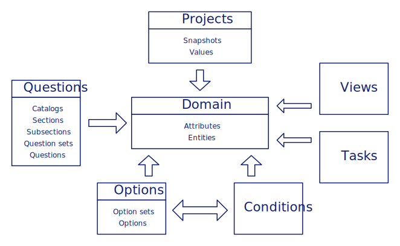

Management
==========

A freshly installed instance of RDMO is not very useful without a questionaire to fill out by the user and a set of DMP templetes later to be populated by the given answers. The main idea of RDMO is that every question and every output can be customized by you. This, however, introduces a certain level of complexity. RDMO employs a datamodel organized along different Django apps and models (representing database tables). A graphical overview is given in the figure below:

   Overview of the RDMO data model.

A full representation is shown :doc:`on a different page </development/figures>`. Here, we explain the different parts of the data model. Each section has a link to a more detailed explanation how to create and edit the relevant elements.

For most users, the structured interview will be the most visible part of RDMO. It is configured using **catalogs**, **sections**, **subsections**, **questionsets**, and **questions**. A single installation of RDMO can have several catalogs. When creating a new project, a user can select one of these catalogs to be used with this project. A catalog has a number of sections, which themselves have subsections. Questions can be directly added to subsections, which will result in a single question on a single page of the interview. Alternatively, they can be organized into question sets. A question has a text, which will be shown in bold to the user and an optional help text. It also has a widget type, which determines which interface widget is presented to the user (e.g. text field, select field, radio buttons). The questionnaire is configured under ``/questions`` available in the management menu. More documentation about the questions management can be found :doc:`here </management/questions>`.

The **domain model** is the central part of the data model and connects the questions from the questionnaire with the user input. It is organized as a tree-like structure. Every piece of information about a user's project is represented by an **attribute**. In this sense these attributes can be compared to a variable in source code. Attributes are the leaves of the domain model tree and can be organized into **entities**, much like files are organized along directories on a disk. Every question must have an attribute and every question set must have an entity connected to it. An example would be the attribute with the path ``project/schedule/project_start`` for the start date of the project. The attribute itself has the key ``project_start`` and resides in the entity ``schedule``, which itself is located in the entity ``project``.

Attributes can be marked as a collection to allow users to give several answers for the question connected to it. A question connected to this attribute will show a button to add a new item in a new line. An example would be several keywords for a project. Questions with check box widgets also need collection attributes. Entities can also be marked as collections. In this case users can enter sets of answers for all attributes below the entity in the tree. A question set connected to this entity will show interface elements to create new sets of answers. This can be used to ask the same set of questions for different datasets or partner institutions. All entities in the tree below a collection entity adopt this behavior, so that questions about the same set can be spread over several question sets on separate pages of the interview.

Attributes have a value type, which describes if the information is a piece of text, a number, or a date, and can have a unit. Attributes can also have a **range**, which is used for slider widgets. Both attributes and entities can have a **verbose name**. In case of a collection, this verbose name will be shown to the user in interface elements instead of "Add item" or "Add set". Attributes and Entities are configured under ``/domain`` available in the management menu. More documentation about the options management can be found :doc:`here </management/options>`.

Attributes can further be connected to **option sets** consisting of **options**. This allows to use a controlled vocabulary for the user's answers. If an attribute has one or more option sets (and the value type "Options"), the user can choose his/her answer from the different options of these option sets. Select, radio or check box widgets are used in the interview for this feature. Option sets and Options are configured under ``/options`` available in the management menu. More documentation about the options management can be found :doc:`here </management/options>`.

**Conditions** can be connected to attributes and entities. Conditions control if the attributes and entities are valid in the current context. If an attribute is not valid, a question connected to this attribute will not be shown to the user. Similarly, if an entity is not valid, the connected question set is not shown. Conditions are also needed to disable/enable option sets, tasks and can be used in views. Conditions are configured with a source attribute, which will be evaluated, a relation like "equal" or "greater than", and a target. The target is a text string or an option. As an example, if the source is the attribute ``project/legal_aspects/ipr/yesno``, the relations is "equal to", and the target text is "1". The condition will be true for a project where the answer to the question connected to the attribute ``project/legal_aspects/ipr/yesno`` is "1" (or "yes" for a yesno widget). Conditions configured under ``/conditions`` are available in the management menu. More documentation about the conditions management can be found :doc:`here </management/conditions>`.

**Views** allow to custom DMP templates in RDMO. To this purpose every view has a template, which can be edited using the Django template sytax based on HTML. Views have also a title and a help text to be shown in the project overview. Views are configured under ``/views`` and are  available in the management menu. More documentation about editing views can be found :doc:`here </management/views>`.

After filling out the interview, the user will be presented with follow up **tasks** based on his/her answers. A task has a title and a text. **Time frames** can be added to tasks, which themselves are evaluating attributes of the value type "datetime", to use answers such as the beginning or the end of a project to compute meaningful tasks. Most of the time tasks will have a condition connected to them, to determine if this task is needed for a particular project or not. Tasks configured under ``/tasks`` are available in the management menu. More documentation about editing views can be found :doc:`here </management/tasks>`.

The different elements of the RDMO datamodel have various parameters, which control their behavior in RDMO and can be configured using the different management pages, which are decribed on the following pages. In addition, all elements contain a set of common parameters:

* An URI Prefix to identify the entity who created this element.
* A key which is the internal identifier for this element.
* An internal comment to share information to be seen by users with access to the management backend.

The key is used as an internal identifier and determines, together with the URI Prefix, the URI of the element. This URI is used as a global identifier for the export/import functionality.

.. toctree::
   :caption: Index
   :maxdepth: 2

   questions
   domain
   options
   conditions
   views
   tasks
   export
