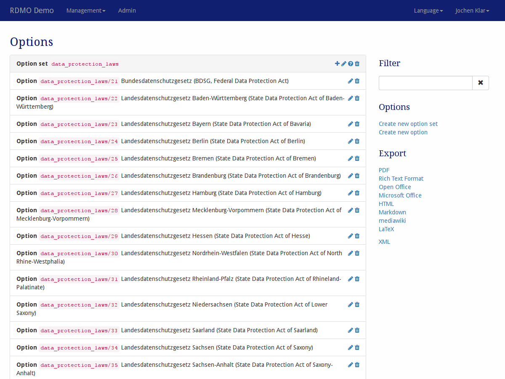

Options
-------

Options and option sets can be managed under *Options* in the management menu in the navigation bar.

   Screenshot of the options management interface.

On the left-hand side is the main display of all the option sets and options available in this installation of RDMO. Option sets show their key, while options show their path and their text. On the left side of each elements panel, icons indicate ways to interact the element. The following options are available:

* **Add** (|add|) a new option to an option set.
* **Update** (|update|) an option set or option to change its properties.
* **Update conditions** (|conditions|) of an option set. A question connected to an attribute, which is itself connected to an option set with one or more conditions, will not show the options of the set in the questionaire, if the condition is evaluated to be false. The conditions themselves are configured in :doc:`the conditions management <conditions>`.
* **Delete** (|delete|) an option set or option and, in the case of an option set, all of it's options. **This action cannot be undone!**

.. |add| image:: ../_static/img/icons/add.png
.. |update| image:: ../_static/img/icons/update.png
.. |conditions| image:: ../_static/img/icons/conditions.png
.. |delete| image:: ../_static/img/icons/delete.png

The sidebar on the left shows additional interface items:

* **Filter** filters the view according to a user given string. Only elements containing this string in their path will be shown.
* **Options** offers additional operations:

  * Create a new (empty) option set
  * Create a new (empty) option

* **Export** exports the options sets to one of the displayed formats. While the textual formats are mainly for presentation purposes, the XML export can be used to transfer the options sets to a different installation of RDMO.

Option sets and options model have different properties to control their behavior. As descibed in :doc:`the introduction <index>`, all elements have an URI Prefix, a key, and an internal comment only to be seen by other managers of the RDMO installation. In addition, you can edit the parameters below:

Option set
""""""""""

Order
  Controls the position of the option set in lists or in the interview (if an attribute has more than one option set).

Option
""""""

Option set
  The option set this option belongs to. Changing the option set will move the option to a different option set.

Order
  Controls the position of the option in lists or in the interview.

Text (en)
  The English text for the option to be displayed to the user.

Text (de)
  The German text for the option to be displayed to the user.

Additional input
  Designates whether an additional input is possible for this option. In this case a text box is displayed to the radio button or check box. Usually this is used for an option "Other".
