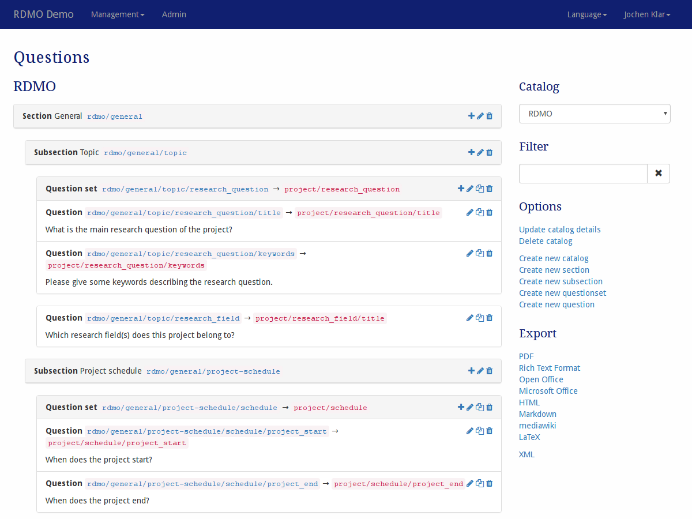

Questions
---------

The questions management is available under *Questions* in the management menu in the navigation bar. The link in the navbar opens the first catalog. Other catalogs can be selected in the sidebar afterwards.

   Screenshot of the questions management interface.

On the left-hand side is the main display of sections, subsections, and questions for the current catalog. For sections and subsections the title and the key is shown. For questions and question set the key and the key of the attribute or entity they are connected with is shown. The order of the different elements is the same as in the structured interview shown to the user. On the left side of each elements panel, icons indicate ways to interact the element. The following options are available:

* **Add** (|add|) a new subsection to a section, a new question or question set to a subsection or a new question to a questionset.
* **Update** (|update|) an element to change its properties.
* **Copy** (|copy|) a question or questionset. This will open the same modal as update. You can change some of the properties and save the elememt as a new one. This can save time when creating several similar questions.
* **Delete** (|delete|) an element and all of it's decendents (e.g. a subsection and all the questions and question sets it contains). **This action cannot be undone!**

.. |add| image:: ../_static/img/icons/add.png
.. |update| image:: ../_static/img/icons/update.png
.. |copy| image:: ../_static/img/icons/copy.png
.. |delete| image:: ../_static/img/icons/delete.png

The sidebar on the right-hand side shows additional interface items:

* **Catalog** switches the view to a different Catalog.
* **Filter** filters the view according to a user given string. Only elements containg this string in their ``path`` will be shown.
* **Options** offers additional operations:

  * Update the details of the current catalog
  * Delete the current catalog
  * Create a new (empty) catalog
  * Create a new (empty) section
  * Create a new (empty) subsection
  * Create a new (empty) question set
  * Create a new (empty) question

* **Export** exports the current catalog to one of the displayed formats. While the text based formats are mainly for showing the full catalog, the XML export can be used to transfer this catalog to a different installation of RDMO.

The different elements of the questionaire have different properties to control their behavior. As descibed in :doc:`the introduction <index>`, all elements have an URI Prefix, a key, and an internal comment only to be seen by other managers of the RDMO installation. In addition, you can edit the parameters below:

Catalog
"""""""

Order
  Controls the position of the catalog in lists or in the interview.

Title (en)
  The English title for the catalog to be displayed to the user.

Title (de)
  The German title for the catalog to be displayed to the user.

Section
"""""""

Catalog
  The catalog this section belongs to. Changing the catalog will move the section to a different catalog. Therefore it will not be visible in the current view anymore.

Order
  Controls the position of the section in lists or in the interview.

Title (en)
  The English title for the section to be displayed to the user.

Title (de)
  The German title for the section to be displayed to the user.

Subsection
""""""""""

Section
  The section this subsection belongs to. Changing the section will move the subsection into another section.

Order
  Controls the position of the subsection in lists or in the interview.

Title (en)
  The English title for the subsection to be displayed to the user.

Title (de)
  The German title for the subsection to be displayed to the user.

Question sets
"""""""""""""

Subsection
  The subsection this question set belongs to. Changing the subsection will move the question set into another section.

Order
  Controls the position of the subsection in lists or in the interview.

Entity
  The entity from the domain model this question set is connected to. Note that the way the question set is presented to the user is partly determined by the entity. A question connected to a collection entity will allow for answers for different sets.

Title (en)
  The English title for the subsection to be displayed to the user.

Title (de)
  The German title for the subsection to be displayed to the user.

Questions
"""""""""

Subsection
  The subsection this question belongs to. Changing the subsection will move the question set into another section.

Parent
  The question set this question belongs to. This should be "- - -" for a question added directly to a subsection and not to a question set.

Order
  Controls the position of the subsection in lists or in the interview.

Attribute
  The attribute from the domain model this question is connected to. Note that the way the question is presented to the user is partly determined by the entity. A question connected to an collection entity will allow for more than one answer and shows an "Add item" button.

Widget type
  The type of widget for the question. The following widgets can be selected:

  * **Text** (a one line text field)
  * **Textarea** (a multi-line text field)
  * **Yes/No** (a set of radio buttons for "Yes" and "No")
  * **Checkboxes** (a set of check boxes, the connected attribute needs to be a collection)
  * **Radio Buttons** (a set of radio buttons, the connected attribute needs to have an option set)
  * **Select drop down** (a drop down menu, the connected attribute needs to have an option set)
  * **Range slider** (a horizontal slider, the connected attribute needs to have a range)
  * **Date picker** (a drop down element with a calender to select a date, the connected attribute needs to have the value type datetime)

Text (en)
  The English text for the question. The text will be shown in bold face to the user.

Title (de)
  The German text for the question. The text will be shown in bold face to the user.

Help (en)
  The English help text for the question. The help text will be shown in grey to the user.

Help (de)
  The German help text for the question. The help text will be shown in grey to the user.
