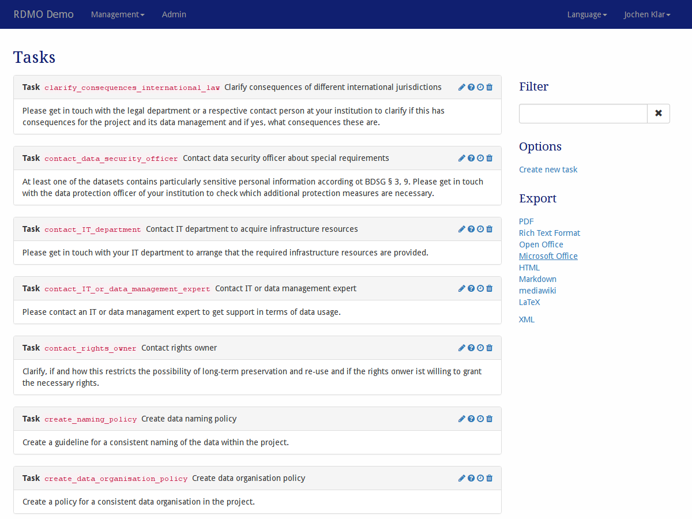
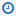

Tasks
-----

Tasks can be configured under *Tasks* in the management menu in the navigation bar.

   Screenshot of the tasks management interface.

On the left-hand side is the main display of all the tasks available in this installation of RDMO. Tasks show their key, title and the text describing the task. On the left side of each tasks panel, icons indicate ways to interact the element. The following options are available:

* **Update** (|update|) a task to change its properties.
* **Update conditions** (|conditions|) of a task. A task will only be shown to the user, if all of its conditions are evaluated ``True``. The conditions themselved are configured in :doc:`the conditions management <conditions>`.
* **Update the time frame** (|timeframe|) of a task. The time frame is constructed from one or two dates from the user's answers. This allows for tasks about a specific deadline or special period.
* **Delete** (|delete|) a task. **This action cannot be undone!**

.. |update| image:: ../_static/img/icons/update.png
.. |conditions| image:: ../_static/img/icons/conditions.png

.. |delete| image:: ../_static/img/icons/delete.png

The sidebar on the left shows additional interface items:

* **Filter** filters the view according to a user given string. Only tasks containing this string in their path will be shown.
* **Options** offers additional operations:

  * Create a new task

* **Export** exports the conditions to one of the displayed formats. While the textual formats are mainly for presentation purposes, the XML export can be used to transfer the tasks to a different installation of RDMO.

Tasks have different properties to control their behavior. As descibed in :doc:`the introduction <index>`, all elements have an URI Prefix, a key, and an internal comment only to be seen by other managers of the RDMO installation. In addition, you can edit the parameters below:

Task
""""

Title (en)
  The English title for the view. The title will be shown in the projects overview.

Title (de)
  The German title for the view.  The title will be shown in the projects overview.

Text (en)
  The English text for the view. The text will be shown in the projects overview.

Text (de)
  The German text for the view. The text will be shown in the projects overview.

Time frame
""""""""""

Start date attribute
  The attribute that sets the start date for this task. The attribute needs to be of value type *datetime*.

End date attribute
  The Attribute that sets the end date for this task (optional, if no end date attribute is given, the start date attribute sets also the end date). The attribute needs to be of value type *datetime*.

Days before
  Additional days before the start date.

Days after
  Additional days after the end date.
