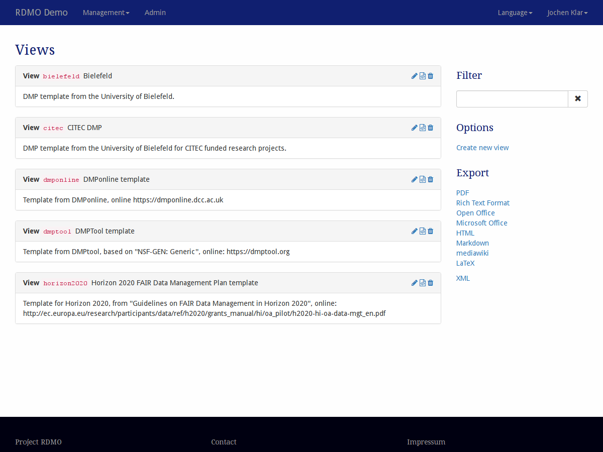
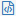
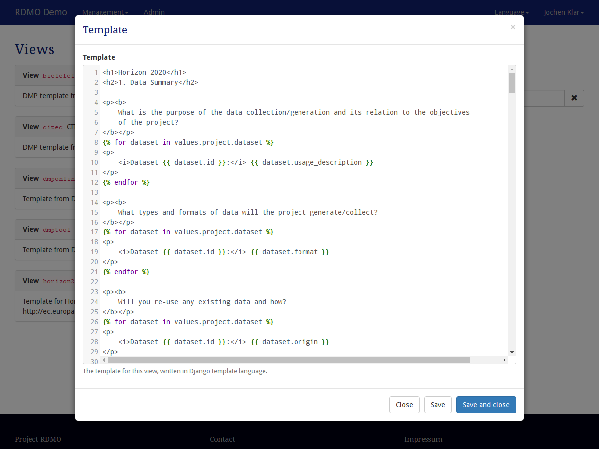

Views
-----

Views can be configured under *Views* in the management menu in the navigation bar.

   Screenshot of the views management interface.

On the left-hand side is the main display of all the views available in this installation of RDMO. Views show their key, title and description. On the left side of each views panel, icons indicate ways to interact the element. The following options are available:

* **Update** (|update|) a view to change its properties.
* **Edit the template** (|template|) of a view.
* **Delete** (|delete|) a view. **This action cannot be undone!**

.. |update| image:: ../_static/img/icons/update.png

.. |delete| image:: ../_static/img/icons/delete.png

The sidebar on the right shows additional interface items:

* **Filter** filters the view according to a user given string. Only views containing this string in their path will be shown.
* **Options** offers additional operations:

  * Create a new view

* **Export** exports the conditions to one of the displayed formats. While the textual formats are mainly for presentation purposes, the XML export can be used to transfer the views to a different installation of RDMO.

Views have different properties to control their behavior. As descibed in :doc:`the introduction <index>`, all elements have an URI Prefix, a key, and an internal comment only to be seen by other managers of the RDMO installation. In addition, you can edit the parameters below:

View
""""

Title (en)
  The English title for the view. The title will be shown in the projects overview.

Title (de)
  The German title for the view.  The title will be shown in the projects overview.

Help (en)
  The English help text for the view. The help text will be shown in the projects overview.

Help (de)
  The German help text for the view. The help text will be shown in the projects overview.

Template
""""""""

   Screenshot of the template modal.

Each view has a template, which determines how the answers given by the user are mapped to a textual document. The template is composed using the `Django template <https://docs.djangoproject.com/en/1.11/ref/templates/language/>`_ syntax, which is a combination of regular HTML, variables, which get replaced with values when the template is evaluated (``{{ a_variable }}``), and tags, which control the logic of the template (````).

Two variables can be used when used in RDMO templates:

* ``values``, which contains nested dictionary mapping the users answers to their attributes.
* ``conditions``, which is a dictionary mapping the keys of the conditions to the evaluated conditions according to the current project (i.e. ``True`` or ``False``).

Consider an attribute ``project/research_question/title`` (more specific an attribute ``title`` in the entity ``research_question`` in the entity ``project``) and a user, who answered the question connected to this attribute with "To boldly go where no man has gone before.". The attribute would be available in the template as ``values.project.research_question.title`` (note the ``.`` instead of ``/``). Used in the template using the sytax for a variable:

.. code-block:: django

    The main research question of the project is: {{ values.project.research_question.title }}

would, when evaluated in the context by a user in his/her project, render:

.. code-block:: django

    The main research question of the project is: To boldly go where no man has gone before.

Collections can be rendered using the ``for`` tag of the Django template syntax.

.. code-block:: django

    <ul>
    
        <li>{{ keyword }}</li>
    
    </ul>

The usual filters of the Django syntax can also be used, e.g.

.. code-block:: django

    

        {{ values.project.research_question.keywords | join:', ' }}
    

For collection entities, you can use:

.. code-block:: django

    
    

        <i>Dataset {{ dataset.id }}:</i> {{ dataset.usage_description }}
    

    

Conditions can be used using the ``if`` tag:

.. code-block:: django

    
    This will be only rendered if personal_data resolves to be true.
    

Please consult the documentation of the Django template syntax for all the available tags and filters: https://docs.djangoproject.com/en/1.11/ref/templates/language.
